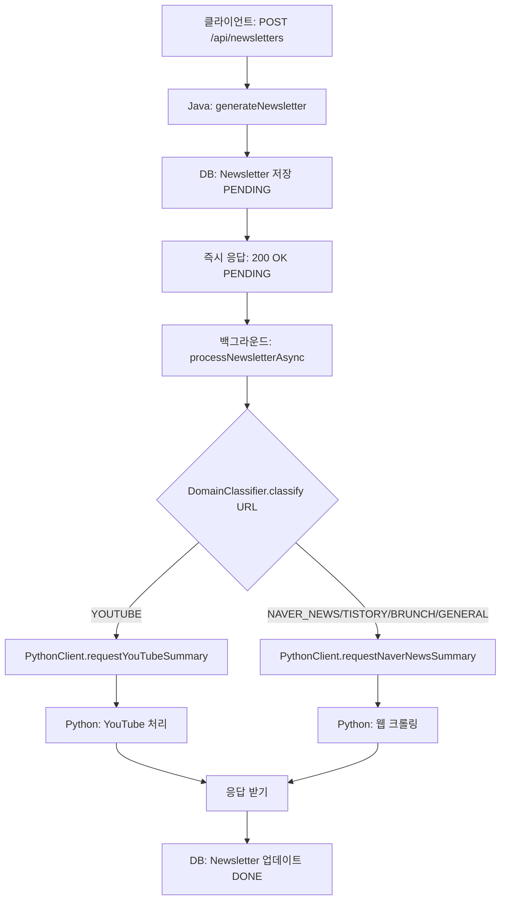

# URL 자동 도메인 분류 가이드

## 📋 개요

Java 서버에서 URL만 받아서 자동으로 도메인(플랫폼)을 판별하고, 적절한 Python 엔드포인트로 라우팅하는 기능입니다.

## 🎯 지원 도메인

| 도메인 타입 | 플랫폼 예시 | Python 엔드포인트 |
|-----------|------------|------------------|
| **YOUTUBE** | YouTube 영상 | `/api/v1/summarize/youtube` |
| **NAVER_NEWS** | 네이버 뉴스 | `/api/v1/summarize/naver-news` |
| **TISTORY** | 티스토리 블로그 | `/api/v1/summarize/naver-news` |
| **BRUNCH** | 브런치 | `/api/v1/summarize/naver-news` |
| **GENERAL** | 기타 웹사이트 | `/api/v1/summarize/naver-news` |

> **참고**: 네이버 뉴스, 티스토리, 브런치, 일반 웹사이트는 모두 웹 크롤링이 필요하므로 동일한 Python 엔드포인트를 사용합니다.

## 🔍 URL 패턴 매칭

### YouTube
```
✅ https://www.youtube.com/watch?v=4I8fWk0k7Y8
✅ https://youtu.be/4I8fWk0k7Y8
```

### 네이버 뉴스
```
✅ https://news.naver.com/main/read.nhn?mode=LSD&mid=sec&sid1=105&oid=001&aid=0012345678
✅ https://n.news.naver.com/mnews/article/629/0000461258
```

### 티스토리
```
✅ https://example.tistory.com/123
✅ https://blog.tistory.com/post/456
```

### 브런치
```
✅ https://brunch.co.kr/@username/123
```

## 🚀 사용 방법

### 1. DomainClassifier 사용 예시

```java
import com.archiveat.server.global.util.DomainClassifier;
import com.archiveat.server.global.util.DomainClassifier.DomainType;

// URL 분류
String url = "https://www.youtube.com/watch?v=4I8fWk0k7Y8";
DomainType type = DomainClassifier.classify(url);

System.out.println(type);  // YOUTUBE
System.out.println(type.getDescription());  // "YouTube 영상"

// 타입별 처리
if (type.isYouTube()) {
    // YouTube 로직
} else if (type.needsWebCrawling()) {
    // 웹 크롤링 로직
}
```

### 2. NewsletterService 자동 라우팅

```java
// URL만 전달하면 자동으로 적절한 Python 엔드포인트 호출
public void processNewsletterAsync(Long newsletterId, String contentUrl) {
    // 1. URL 도메인 자동 분류
    DomainType domainType = DomainClassifier.classify(contentUrl);
    
    // 2. Python 서버 호출 (도메인 타입에 따라 자동 라우팅)
    CompletableFuture<PythonSummaryResponse> future;
    
    if (domainType.isYouTube()) {
        future = pythonClientService.requestYouTubeSummary(contentUrl);
    } else if (domainType.needsWebCrawling()) {
        future = pythonClientService.requestNaverNewsSummary(contentUrl, null);
    } else {
        throw new IllegalArgumentException("Unsupported domain type: " + domainType);
    }
    
    // 3. 응답 처리
    PythonSummaryResponse response = future.get();
    newsletter.updateFromPythonResponse(response);
}
```

## 📊 처리 흐름



## 🧪 테스트

### 단위 테스트 실행
```bash
./gradlew test --tests "DomainClassifierTest"
```

### 통합 테스트 시나리오

#### 1. YouTube URL
```bash
curl -X POST http://localhost:8080/api/newsletters \
  -H "Content-Type: application/json" \
  -H "Authorization: Bearer YOUR_TOKEN" \
  -d '{
    "contentUrl": "https://www.youtube.com/watch?v=4I8fWk0k7Y8",
    "memo": "AI 관련 영상"
  }'
```

**예상 로그**:
```
URL classified as: YOUTUBE - YouTube 영상
Requesting YouTube summary from Python server
```

#### 2. 네이버 뉴스 URL
```bash
curl -X POST http://localhost:8080/api/newsletters \
  -H "Content-Type: application/json" \
  -H "Authorization: Bearer YOUR_TOKEN" \
  -d '{
    "contentUrl": "https://n.news.naver.com/mnews/article/629/0000461258",
    "memo": "반도체 관련주 주가 분석용"
  }'
```

**예상 로그**:
```
URL classified as: NAVER_NEWS - 네이버 뉴스
Requesting Naver news summary from Python server
```

#### 3. 티스토리 URL
```bash
curl -X POST http://localhost:8080/api/newsletters \
  -H "Content-Type: application/json" \
  -H "Authorization: Bearer YOUR_TOKEN" \
  -d '{
    "contentUrl": "https://example.tistory.com/123",
    "memo": "개발 블로그 글"
  }'
```

**예상 로그**:
```
URL classified as: TISTORY - 티스토리 블로그
Requesting Naver news summary from Python server
```

## ⚙️ 확장 방법

### 새로운 도메인 추가하기

#### 1. DomainClassifier에 패턴 추가
```java
private static final Pattern MEDIUM_PATTERN = Pattern.compile(
        ".*medium\\.com/@.*", Pattern.CASE_INSENSITIVE);

public enum DomainType {
    // ...
    MEDIUM("미디엄"),
    // ...
}
```

#### 2. classify 메서드에 로직 추가
```java
if (MEDIUM_PATTERN.matcher(url).matches()) {
    log.info("Classified as MEDIUM: {}", url);
    return DomainType.MEDIUM;
}
```

#### 3. processNewsletterAsync에 처리 로직 추가
```java
if (domainType == DomainType.MEDIUM) {
    // 미디엄 전용 처리 (웹 크롤링)
    future = pythonClientService.requestNaverNewsSummary(contentUrl, null);
}
```

## 📝 주의사항

1. **User Memo 전달**: 현재는 `processNewsletterAsync`에서 user memo를 전달하지 않습니다 (TODO). 필요시 `UserNewsletter`의 memo도 함께 전달하도록 수정 필요.

2. **UNKNOWN 타입 처리**: URL이 인식되지 않으면 `UNKNOWN` 타입이 반환되며, `IllegalArgumentException`이 발생합니다.

3. **대소문자 무관**: 모든 패턴은 `CASE_INSENSITIVE` 플래그를 사용하여 대소문자를 구분하지 않습니다.

## 🔗 관련 파일

- [DomainClassifier.java](file:///c:/Users/samsung-user/Documents/KU/clubs/KUIT/archiveat/archiveat-java-server/src/main/java/com/archiveat/server/global/util/DomainClassifier.java)
- [NewsletterService.java](file:///c:/Users/samsung-user/Documents/KU/clubs/KUIT/archiveat/archiveat-java-server/src/main/java/com/archiveat/server/domain/newsletter/service/NewsletterService.java)
- [DomainClassifierTest.java](file:///c:/Users/samsung-user/Documents/KU/clubs/KUIT/archiveat/archiveat-java-server/src/test/java/com/archiveat/server/global/util/DomainClassifierTest.java)
