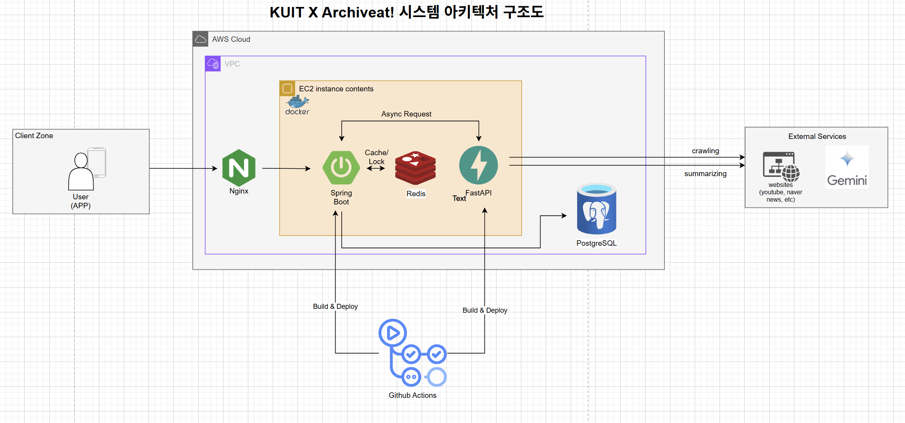
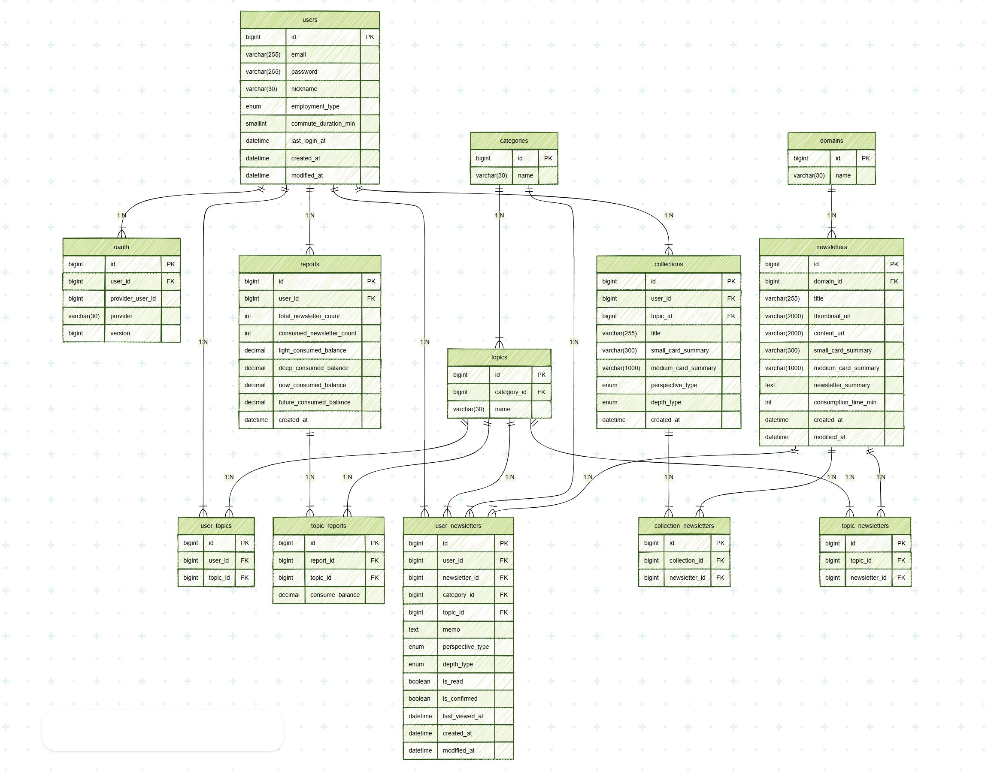

# 📬 Archiveat (아카이빗)
> **LLM 기반 뉴스레터 개인화 요약 및 아카이빙 서비스**
 
## 🏗 System Architecture
Archiveat은 대규모 데이터 처리와 사용자 경험 최적화를 위해 **비동기 분석 파이프라인**을 채택했습니다.

  
   
  <em>Archiveat 전체 시스템 아키텍처</em>

---

## 💾 Database Design (ERD)
복잡한 개인화 요구사항과 대량의 뉴스레터 데이터를 효율적으로 관리하기 위해 정규화된 설계를 지향했습니다.

  
   
  <em>Archiveat 서비스 데이터베이스 설계도 (ERD)</em>

